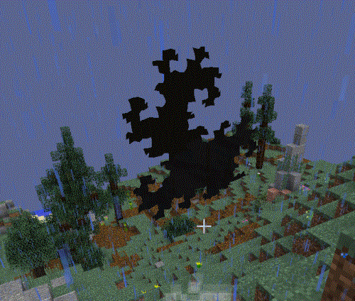

If you encounter an object that looks like the attached image, you've encountered a Rift from Dimensional Doors. These rifts grow in size but are otherwise harmless. They act as a link between one location and another. They appear randomly in worldgen or when a dimensional door is broken. One also replaces the gateway when entering a dimensional doors dungeon. This rift will still lead to the dungeon and the dungeon can be accessed again by placing a wooden dimensional door where the gateway used to be.

There are three ways to deal with a rift: one is to use a rift remover, which will destroy the rift forever. The second is to place a wooden dimensional door on top of it. This will lead to wherever the rift is linked to. If there is no linked location, the door will tell you when you try to use it. The third method is to use a Rift Stabiliser on the rift. This will stop the rift from growing.