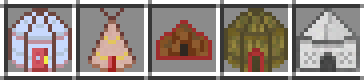
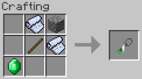
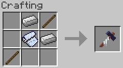

Build a Yurt, Tepee, Bedouin, Indlu, or (New!) Shamiyana - set it up, take it down, and never worry about being too far from home again.
Type @nomadictents in JEI to view all items from this mod.
Tents come in various sizes: from Small (5x5), Medium (7x7), and Large (9x9) to Huge (11x11), Giant (13x13), and Mega (15x15). Here's how you get started:
___

# Step 1: make the tent

You have 5 options for your tent so far: Yurt, Tepee, Bedouin, Indlu, or Shamiyana.
___
# Step 2: upgrade the tent
Size upgrades: Tents can be upgraded in size by crafting them with their previous recipe.
Depth upgrades:  These allow you to increase the layers of dirt underneath your tent. Finally, you can have the testificate prison - I mean, fruit cellar - that you always wanted!

Bigger tents can be upgraded up to 5 times, but you need at least a medium-sized tent to start. Adding the next tier of depth requires the next tier of tent shovel - Stone Tent Shovels are for tier 1 depth, Iron Tent Shovels are for tier 2, and so on for Gold, Obsidian, and Diamond Tent Shovels.

Using these is a breeze! Place the tent in the middle of a crafting grid, the Tent Shovel below it, dirt on the sides and a block of the corresponding material at the top.
Tip:  hold SHIFT while looking at the tent in an inventory to see how many times it can be upgraded. Small tents are 0, medium are 1, etc. until mega tents, which are 5.
___
# Step 3: build the tent
First make a Tent Mallet. The tent is not going to construct itself!

Use the tent item to place frame blocks in the shape of your tent. Then hit each piece with the Tent Mallet to build. This will take a couple minutes in real-time, so don't wait until night falls to start!
The Super Tent Mallet can do this with just one click! It may be a creative-mode only item depending on the config.
___
# Step 4: enjoy the tent!
When you finish building the tent, click on the door to enter (preferably with an empty hand).

What's this? My tent was 5x5 when I built it, but the inside is much bigger!

That is the magic of Nomadic Tents: Tents can be the same size on the outside (and take the same amount of time to set up), but the inside can be luxurious and roomy! If you upgrade it, that is.
___
# Step 5: move the tent
How useful is a house when it's stuck in one spot? Not very useful, which is why Nomadic Tents exists in the first place!

Simply use the Tent Mallet on the door to de-construct your tent. Set it up somewhere else and everything will still be inside.