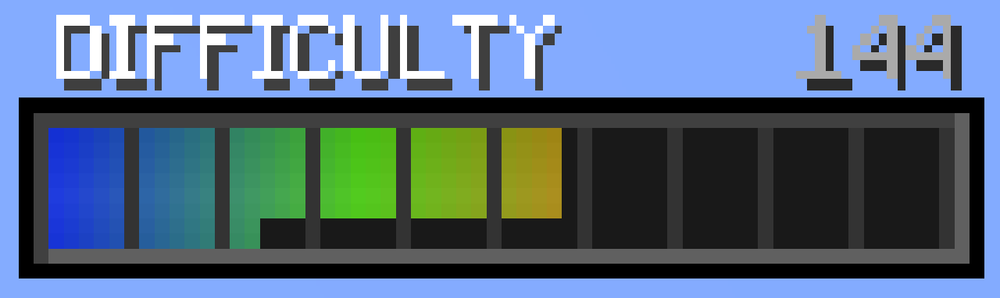

This modpack have a global difficulty system. Basically, the longer you play the game, the more difficult it is going to be.

Key Features:
- A per-player difficulty system. A difficulty value is tracked for each player. There are several factors that can increase/decrease your difficulty. By default, it increasing slowly as time passes. As difficulty increases, mobs become stronger. 

- More player health! Or less. Players can obtain heart containers that increase their maximum health. Normally, you keep the extra health even after dying. 

- Blights are extremely powerful mobs. These are ordinary mobs (even from other mods) that have spawned with far more health, higher damage-dealing potential, and a variety of potion effects including a large speed boost. They also tend to spawn with armor.

Factors to count in your Increase of personal Difficulty are: 
• Distance traveled (from Spawn/Origin), 
• Numbers of Killed Monsters, 
• Gameplay Time (Increase per Second)

Factors manipulated for Monsters are:
• Damage 
• Chance for Potion Effect (Effects are: Strength, Speed, Fire Restistance, Invisibility and Restistance)
• Experience Drop Increase
• Base Health