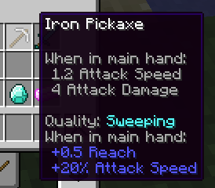
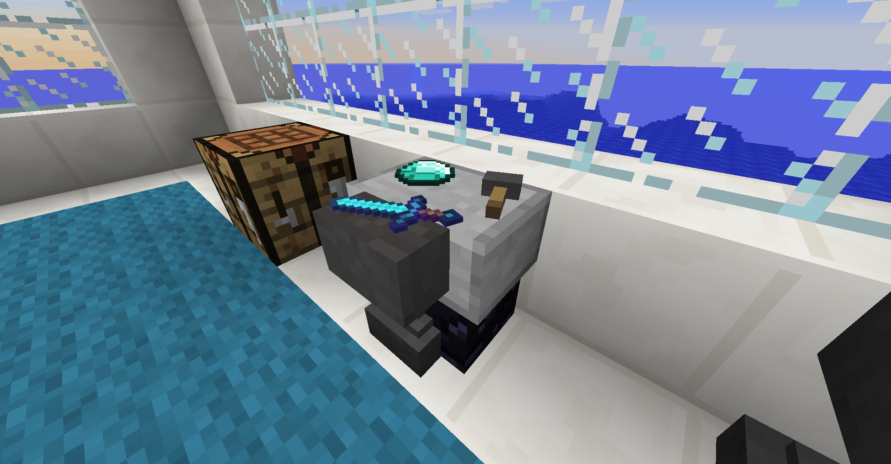

Tools, armor, and weapons have random qualities when they enter your inventory.

You can use reforging station to change your tool's quality. 

Use the reforging station by placing your tool in the top slot, and the material you would use to repair it in the bottom slot, then clicking the button.